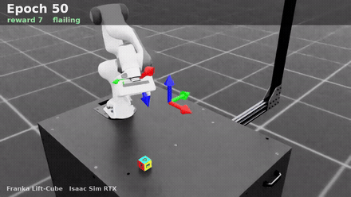
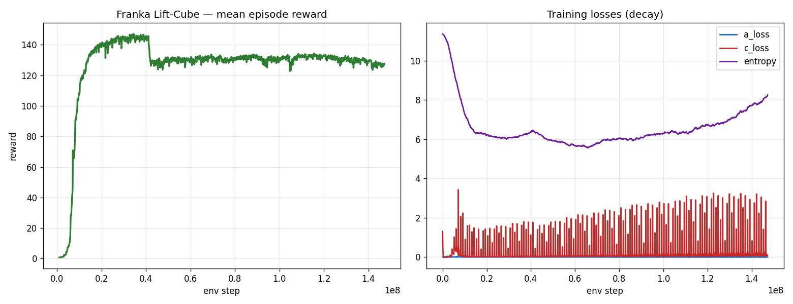
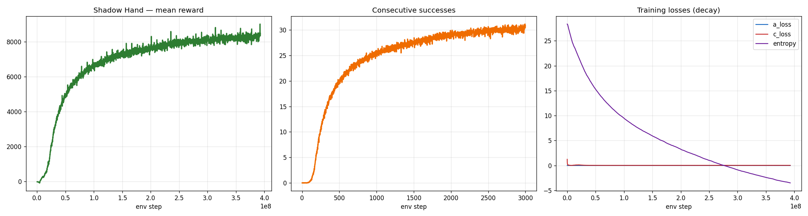

# Teaching Robots to Move with Reinforcement Learning

This project trains two robots to complete real manipulation tasks entirely on their own — no
hand-written instructions. Each robot starts out clumsy and random, and through trial and error
gradually learns a skill. Everything runs inside **NVIDIA Isaac Sim**, a physics simulator that can
run thousands of practice attempts at the same time on a single GPU. The timelapses below show the
full journey, from random flailing to a robot that actually knows what it's doing.

| Franka arm: pick-and-place | Shadow Hand: in-hand rotation |
|---|---|
|  |  |

Full-resolution renders: [`franka_lift_timelapse.mp4`](assets/franka_lift_timelapse.mp4),
[`shadow_hand_timelapse.mp4`](assets/shadow_hand_timelapse.mp4).

## How the learning works (the simple version)

The robot tries an action, gets a score for how well it did, and slowly adjusts its behavior to earn
higher scores over time. Good moves get reinforced, bad moves get discouraged. Repeat this millions
of times and a skill emerges. The method behind it is a well-known algorithm called **PPO**, which is
good at improving steadily without the training going off the rails.

Because thousands of copies of the robot practice in parallel, what would take a real robot weeks
happens in minutes.

## Task 1 — Franka arm: pick-and-place

A robotic arm has to reach a cube on a table, grab it, and move it to a target spot. The robot earns
points for getting its gripper closer to the cube, then more points for lifting it, and even more for
carrying it to the goal. This one learns quickly — a solid grab-and-place shows up fast.

## Task 2 — Shadow Hand: rotating a cube in-hand

A robotic hand with lots of moving fingers has to spin a cube in place until it matches a target
orientation — then a new target appears, and it keeps going. This is much harder: real dexterity,
like turning an object over in your fingers without dropping it. Over lots of training the hand goes
from dropping the cube immediately to chaining around thirty successful rotations in a row.

## How it was built

- **Massive parallel practice.** Thousands of simulated robots (4,096 for the arm, 8,192 for the
  hand) practicing at once on a single GPU. The arm trains in minutes, the hand in about half an hour.
- **A memory for the hard task.** The Shadow Hand uses a policy with short-term memory to handle the
  fact that it can't perfectly "see" everything happening in its grip.
- **Keeping training stable.** Careful normalization, controlled update sizes, and randomizing things
  like object weight and friction so the robots learn a general skill instead of memorizing one setup.
- **The visuals.** Simulation and learning run entirely on the GPU; the final clips are rendered with
  realistic ray-traced lighting for a clean, cinematic look.

Hardware: a single NVIDIA RTX 4090.
